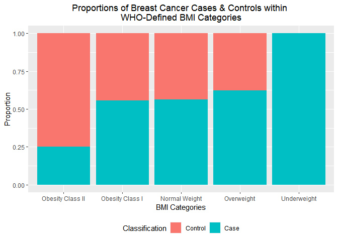

P8451 Machine Learning in Public Health - Assignment 1
================
2023-1-24

In preparation for the problems below, we will load the following
libraries:

``` r
library(tidyverse)
```

    ## ── Attaching packages ─────────────────────────────────────── tidyverse 1.3.2 ──
    ## ✔ ggplot2 3.4.0      ✔ purrr   0.3.5 
    ## ✔ tibble  3.1.8      ✔ dplyr   1.0.10
    ## ✔ tidyr   1.2.1      ✔ stringr 1.5.0 
    ## ✔ readr   2.1.3      ✔ forcats 0.5.2 
    ## ── Conflicts ────────────────────────────────────────── tidyverse_conflicts() ──
    ## ✖ dplyr::filter() masks stats::filter()
    ## ✖ dplyr::lag()    masks stats::lag()

``` r
library(dplyr)
library(psych)
```

    ## 
    ## Attaching package: 'psych'
    ## 
    ## The following objects are masked from 'package:ggplot2':
    ## 
    ##     %+%, alpha

# Question 1

## 1.1 Data Import and Cleaning

We will begin by importing the dataset used by authors Patricio et al
for the development of a biomarker-based prediction model to identify
women with breast cancer. To do so, we will first read in the data by
using the `read_csv` function, then apply the `clean_names` function to
quickly clean the data.

``` r
breast_cancer_data = 
  read_csv("./bcdata_Assignment1.csv") %>% 
  janitor::clean_names()
```

    ## Rows: 116 Columns: 10
    ## ── Column specification ────────────────────────────────────────────────────────
    ## Delimiter: ","
    ## dbl (10): Age, BMI, Glucose, Insulin, HOMA, Leptin, Adiponectin, Resistin, M...
    ## 
    ## ℹ Use `spec()` to retrieve the full column specification for this data.
    ## ℹ Specify the column types or set `show_col_types = FALSE` to quiet this message.

## 1.2 Tabulating Summaries of Quantitative Features

To generate a table providing the summaries of the quantitative features
of the dataset, we can apply the `describe` function, which generates a
variety of summary statistics. From this output, we will select the
following: mean, median, minimum value, and maximum value.

``` r
describe(breast_cancer_data) %>% 
  select("mean", "median", "min", "max") %>% 
  knitr::kable(col.names = c('Mean', 'Median', 'Minimum Value', 'Maximum Value'))
```

|                |       Mean |     Median | Minimum Value | Maximum Value |
|:---------------|-----------:|-----------:|--------------:|--------------:|
| age            |  57.301724 |  56.000000 |    24.0000000 |      89.00000 |
| bmi            |  27.582111 |  27.662416 |    18.3700000 |      38.57876 |
| glucose        |  97.793103 |  92.000000 |    60.0000000 |     201.00000 |
| insulin        |  10.012086 |   5.924500 |     2.4320000 |      58.46000 |
| homa           |   2.694988 |   1.380939 |     0.4674087 |      25.05034 |
| leptin         |  26.615080 |  20.271000 |     4.3110000 |      90.28000 |
| adiponectin    |  10.180874 |   8.352692 |     1.6560200 |      38.04000 |
| resistin       |  14.725966 |  10.827740 |     3.2100000 |      82.10000 |
| mcp_1          | 534.647000 | 471.322500 |    45.8430000 |    1698.44000 |
| classification |   1.551724 |   2.000000 |     1.0000000 |       2.00000 |

# Question 2

We will now recode the existing BMI variable into the following
WHO-defined categories:

- Severely Underweight - BMI less than 16.5 kg/m^2
- Underweight - BMI under 18.5 kg/m^2
- Normal Weight - BMI greater than or equal to 18.5 to 24.9 kg/m^2
- Overweight – BMI greater than or equal to 25 to 29.9 kg/m^2
- Obesity Class I – BMI 30 to 34.9 kg/m^2
- Obesity Class II – BMI 35 to 39.9 kg/m^2
- Obesity Class III – BMI greater than or equal to 40 kg/m^2

This process involves converting the existing `bmi` variable from a
numeric to factor variable with 7 levels, using the `as.factor`
function, as well as a series of `ifelse` statements.

``` r
breast_cancer_data$bmi_category <- as.factor(ifelse(breast_cancer_data$bmi < 16.5, 'Severely Underweight',
                                             ifelse(breast_cancer_data$bmi < 18.5, 'Underweight', 
                                             ifelse(breast_cancer_data$bmi < 25, 'Normal Weight',
                                             ifelse(breast_cancer_data$bmi < 30, 'Overweight',
                                             ifelse(breast_cancer_data$bmi < 35, 'Obesity Class I',
                                             ifelse(breast_cancer_data$bmi < 40, 'Obesity Class II',
                                             'Obesity Class III')))))))
```

# Question 3

Using the dataset generated from Question 2, we can generate a bar chart
depicting the proportion of breast cancer cases and controls within each
BMI category.

``` r
breast_cancer_data %>% 
  group_by(bmi_category) %>%
  mutate(n = n(),
         cases = sum(classification - 1),
         prop_cases = cases / n) %>% 
  ggplot(aes(x = reorder(bmi_category, prop_cases), fill = factor(classification))) +
  geom_bar(position = "fill") +
  labs(
    title = "Proportions of Breast Cancer Cases & Controls within \nWHO-Defined BMI Categories", 
    x = "BMI Categories", 
    y = "Proportion", 
    fill = "Classification") +
  theme(plot.title = element_text(hjust = 0.5),
        legend.position = "bottom") +
  scale_fill_discrete(labels = c('Control', 'Case'))
```

<!-- -->

# Question 4

Below we construct a logistic regression model using breast cancer
classification as the outcome of interest, and glucose, HOMA-IR, leptin,
continuous BMI, and age as the independent variables of interest.

``` r
breast_cancer_data = breast_cancer_data %>% 
  mutate(classification = as.factor(recode(classification, 
                                           "1" = 0,
                                           "2" = 1)))

classification_logistic = 
  breast_cancer_data %>% 
  glm(classification ~ glucose + homa + leptin + bmi + age, data = ., family = binomial())


classification_logistic %>% 
  broom::tidy() %>% 
  mutate(lower_CI = estimate - 1.96*std.error, 
         upper_CI = estimate + 1.96*std.error) %>% 
  select(term, estimate, lower_CI, upper_CI, p.value) %>% 
  knitr::kable(col.names = c('Term', 'beta Estimate', 'Lower 95% CI', 'Upper 95% CI', "p-value"), digits = 3)
```

| Term        | beta Estimate | Lower 95% CI | Upper 95% CI | p-value |
|:------------|--------------:|-------------:|-------------:|--------:|
| (Intercept) |        -3.626 |       -8.242 |        0.990 |   0.124 |
| glucose     |         0.082 |        0.036 |        0.128 |   0.001 |
| homa        |         0.274 |       -0.063 |        0.611 |   0.111 |
| leptin      |        -0.009 |       -0.040 |        0.022 |   0.587 |
| bmi         |        -0.104 |       -0.215 |        0.007 |   0.066 |
| age         |        -0.023 |       -0.051 |        0.005 |   0.111 |

The beta estimate associated with a 1-unit change in *HOMA-IR* is
**0.274**. The 95% confidence interval surrounding this beta estimate is
**(-0.063, 0.611)**.

# Question 5

Below we construct linear regression model using insulin as the outcome
of interest, and continuous BMI, age, and glucose as the independent
variables of interest.

``` r
insulin_linear = 
  breast_cancer_data %>% 
  lm(insulin ~ bmi + age + glucose, data = .)

insulin_linear %>% 
  broom::tidy() %>% 
  mutate(lower_CI = estimate - 1.96*std.error, 
         upper_CI = estimate + 1.96*std.error) %>% 
  select(term, estimate, lower_CI, upper_CI, p.value) %>% 
  knitr::kable(col.names = c('Term', 'beta Estimate', 'Lower 95% CI', 'Upper 95% CI', "p-value"), digits = 3)
```

| Term        | beta Estimate | Lower 95% CI | Upper 95% CI | p-value |
|:------------|--------------:|-------------:|-------------:|--------:|
| (Intercept) |       -13.496 |      -24.980 |       -2.011 |   0.023 |
| bmi         |         0.150 |       -0.171 |        0.471 |   0.363 |
| age         |        -0.054 |       -0.156 |        0.048 |   0.301 |
| glucose     |         0.230 |        0.156 |        0.303 |   0.000 |

The beta estimate associated with a 1-unit change in *age* is
**-0.054**. The 95% confidence interval surrounding this beta estimate
is **(-0.156, 0.048)**.
